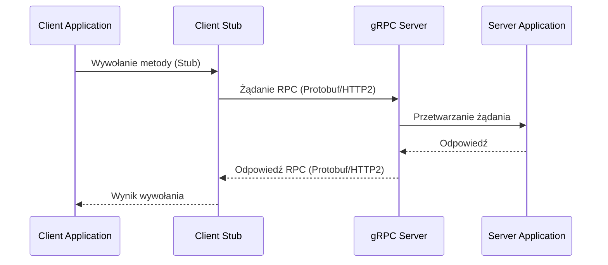

# Architektura gRPC

```mermaid
sequenceDiagram
    participant ClientApp as Client Application
    participant ClientStub as Client Stub
    participant Server as gRPC Server
    participant ServerApp as Server Application
    ClientApp ->> ClientStub: Wywołanie metody (Stub)
    ClientStub ->> Server: Żądanie RPC (Protobuf/HTTP2)
    Server ->> ServerApp: Przetwarzanie żądania
    ServerApp -->> Server: Odpowiedź
    Server -->> ClientStub: Odpowiedź RPC (Protobuf/HTTP2)
    ClientStub -->> ClientApp: Wynik wywołania
```