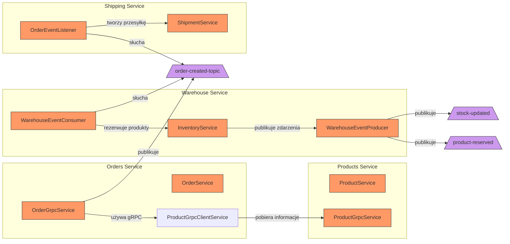

```mermaid
flowchart LR
    subgraph subGraph0["Orders Service"]
        OrderService["OrderService"]
        OrderGrpcService["OrderGrpcService"]
        ProductGrpcClientService["ProductGrpcClientService"]
    end
    subgraph subGraph1["Products Service"]
        ProductService["ProductService"]
        ProductGrpcService["ProductGrpcService"]
    end
    subgraph subGraph2["Warehouse Service"]
        InventoryService["InventoryService"]
        WarehouseEventConsumer["WarehouseEventConsumer"]
        WarehouseEventProducer["WarehouseEventProducer"]
    end
    subgraph subGraph3["Shipping Service"]
        ShipmentService["ShipmentService"]
        OrderEventListener["OrderEventListener"]
    end
    OrderGrpcService -- publikuje --> OrderCreatedTopic[/"order-created-topic"\]
    OrderGrpcService -- używa gRPC --> ProductGrpcClientService
    ProductGrpcClientService -- pobiera informacje --> ProductGrpcService
    WarehouseEventConsumer -- słucha --> OrderCreatedTopic
    WarehouseEventConsumer -- rezerwuje produkty --> InventoryService
    InventoryService -- publikuje zdarzenia --> WarehouseEventProducer
    WarehouseEventProducer -- publikuje --> StockUpdatedTopic[/"stock-updated"\] & ProductReservedTopic[/"product-reserved"\]
    OrderEventListener -- słucha --> OrderCreatedTopic
    OrderEventListener -- tworzy przesyłkę --> ShipmentService
    OrderService:::service
    OrderGrpcService:::service
    ProductService:::service
    ProductGrpcService:::service
    InventoryService:::service
    WarehouseEventConsumer:::service
    WarehouseEventProducer:::service
    ShipmentService:::service
    OrderEventListener:::service
    OrderCreatedTopic:::kafka
    StockUpdatedTopic:::kafka
    ProductReservedTopic:::kafka
    classDef service fill: #f96, stroke: #333, stroke-width: 1px
    classDef kafka fill: #c9e, stroke: #333, stroke-width: 1px
```

